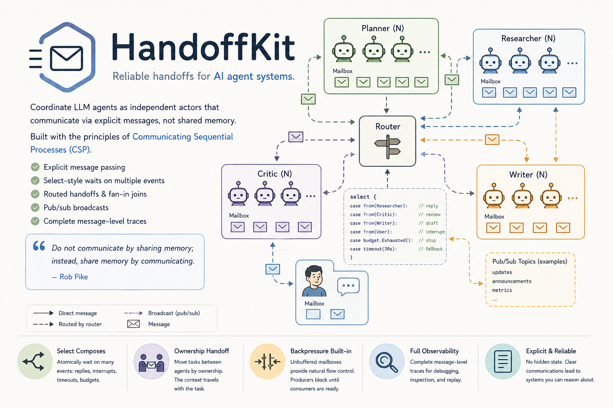

# HandoffKit

[](https://pkg.go.dev/github.com/dyngai/handoffkit)
[](https://developers.openai.com/codex/plugins)
[](#install-as-a-codex-plugin)



**Reliable handoffs for AI agent systems.**

HandoffKit is a Go reference implementation for coordinating LLM agents with
explicit message passing instead of shared coordination scratchpads. It includes
mailboxes, `select`-style waits, routed handoffs, joins/quorums, pub/sub,
budgets, supervision, dead letters, corpus-backed compaction, and message-level
tracing.

> "Do not communicate by sharing memory; instead, share memory by communicating." (Rob Pike)

Read the full blog post here: [HandoffKit: coordinate agents by passing messages, not sharing memory](https://platformpilot.ai/blog/open-sourcing-handoffkit?utm_source=github&utm_medium=referral&utm_campaign=handoffkit).

- Interfaces: [`sketch/`](./sketch)
- Runtime primitives: [`runtime/`](./runtime)
- LLM-backed agents: [`llm/`](./llm)
- Examples: [`examples/`](./examples)
- Design notes: [`docs/`](./docs)

Integration status:

| Surface | Status | Setup | Notes |
|---|---|---|---|
| OpenAI SDK LLM agents | Supported API path | `OPENAI_API_KEY` | Uses the official OpenAI Go SDK. |
| Codex plugin / skills | Supported Codex extension path | `codex plugin marketplace add dyngai/handoffkit`, then install **HandoffKit** from `/plugins` | Provides the `handoffkit` and `handoffkit-scaffold` skills inside Codex. |
| Codex transport LLM agents | Local / unsupported | `codex login` | Reverse-engineered ChatGPT-session transport used for demos and experiments; it can change or break without notice. |

## Core Idea

Treat each agent as an actor: private state, an addressable mailbox, and a
single-owner run loop. Move work by sending messages. Ownership transfers with
the message, so the sender stops touching the task after handoff.

Use message passing for control flow, and a shared conflict-free `Corpus` for
knowledge. That keeps orchestration explicit without trying to ship an entire
context window through prose.

Why it helps:

- `Select` waits on peer messages, interrupts, budgets, cancellation, and
  timeouts in one place.
- Single-owner handoff avoids shared-scratchpad races.
- Unbuffered mailboxes provide natural backpressure.
- `Tracer` gives a complete message-level record.

## What Is Included

| Primitive | Purpose |
|---|---|
| `ChanMailbox` | Channel-backed inbox; unbuffered mailboxes provide rendezvous/backpressure. |
| `Selector` | `reflect.Select` over messages, deadlines, budgets, and cancellation. |
| `Router` | Point-to-point delivery by address. |
| `Broker` | Broadcast one event to every subscriber. |
| `JoinAgent` / `QuorumAgent` | Fan-in barriers. |
| `Budget` | Selectable resource ceiling. |
| `Nursery` | Structured concurrency and topology guard. |
| `MemCorpus` / `Compactor` | Shared referenced knowledge plus bounded handoff summaries. |
| `WithDeadLetters` | Capture undeliverable messages. |
| `RunTraced` / `Tracer` | Message-level observability. |

## How It Compares

Ranked by overall similarity (language, the actor/message-passing model, and the
LLM-agent domain together), the closest repos are:

1. [`go-actor`](https://github.com/vladopajic/go-actor) (Go), the mechanism twin: a generic Actor + CSP library (`Mailbox`, `Worker.DoWork` + `select`), essentially HandoffKit's `runtime/` with the LLM layer removed.
2. [`mabeam`](https://github.com/nshkrdotcom/mabeam) (Elixir/BEAM), the architecture twin: per-process actors, point-to-point signals, an event bus (≈ `Broker`), and OTP supervision trees (≈ `Nursery`), on the runtime where "actor model, not pure CSP" is native.
3. [`llmgo`](https://github.com/hungpdn/llmgo) (Go), the peer product: the same language and niche, but built on a shared-memory blackboard with a central router.

| Capability | **HandoffKit** | go-actor | mabeam | llmgo |
|---|---|---|---|---|
| Language | Go | Go | Elixir/BEAM | Go |
| Actor / mailbox model | ✅ `ChanMailbox` | ✅ `Mailbox` | ✅ BEAM process mailbox | ✅ inbox/outbox chans |
| `select`-composition (peer/user/budget/timeout in one wait) | ✅ `Selector` (`reflect.Select`) | ⚠️ raw `select` in `DoWork` | ⚠️ native `receive`/`after` | ⚠️ engine↔agent RPC (reply/err/timeout) |
| Ownership-transfer handoff (sender lets go) | ✅ `Handoff` + refs | ❌ | ❌ signals/events | ❌ router picks next |
| Point-to-point routing | ✅ `Router` | ⚠️ DIY | ✅ `Registry` + send-to-pid | ✅ `LLMRouter`/`ChainRouter` |
| Pub/sub broadcast | ✅ `Broker` | ❌ | ✅ `EventBus` | ❌ |
| Fan-in join / quorum | ✅ `JoinAgent` / `QuorumAgent` | ❌ | ❌ | ❌ |
| Budget ceiling as selectable value | ✅ `Budget.Done()` (token/$/calls/wall) | ❌ | ❌ | ❌ |
| Shared knowledge store | ✅ `MemCorpus` (CRDT `Merge`) | ❌ | ❌ private state | ⚠️ shared memory + Redis |
| Bounded/lossy handoff compaction | ✅ `Compactor` (measured) | ❌ | ❌ | ❌ |
| Structured concurrency / topology guard | ✅ `Nursery` (depth/lineage, subtree `Cancel`) | ⚠️ `Combine` start/stop | ✅ OTP supervision trees | ⚠️ context cancel only |
| Dead-letter capture | ✅ `WithDeadLetters` | ❌ | ⚠️ monitors / `:DOWN` | ❌ |
| Message-level trace | ✅ `Tracer` (`TraceRecv`/`TraceSend`) | ❌ | ⚠️ `:telemetry` | ⚠️ `StepHandler` callback |
| Tool calling / RAG / streaming | ❌ out of scope | ❌ | ❌ | ✅ all three |
| LLM backends | OpenAI SDK + local/unsupported Codex transport | none | none | Ollama (cloud soon) |
| Posture | design exploration + tested reference impl | minimal actor lib | BEAM multi-agent framework (early) | production-aimed framework |

✅ first-class · ⚠️ partial/adjacent · ❌ absent

No neighbor combines `Select`-composition, ownership-transfer `Handoff`, a
selectable `Budget`, a CRDT `Corpus`, `Compactor`, fan-in `Join`/`Quorum`, a
topology-guarded `Nursery`, and message-level `Tracer`. That combination is the
point; the individual pieces are deliberately unoriginal.

## Install as a Codex Plugin

This repo is also a [Codex plugin](https://developers.openai.com/codex/plugins)
with two skills:

- `handoffkit`: language-agnostic design guidance for message-passing agents.
- `handoffkit-scaffold`: copies the Go reference runtime into a Go project and
  rewrites imports to the target module.

Prereqs: Codex CLI installed and signed in with `codex login`.

Add the GitHub marketplace source:

```sh
codex plugin marketplace add dyngai/handoffkit
```

For local development, launch Codex from this repo or register the local clone:

```sh
cd /path/to/handoffkit
codex

# or, from anywhere:
codex plugin marketplace add /path/to/handoffkit
```

Then open `/plugins`. For the GitHub marketplace source, choose the HandoffKit
entry shown as `handoffkit@handoffkit` or **HandoffKit** depending on your Codex
UI version. For local development, choose the local marketplace entry you
registered. Open **HandoffKit** and select **Install plugin**.

Use it with the `@` picker:

```text
@handoffkit design a message-passing agent pool for triaging alerts.
@handoffkit-scaffold scaffold the Go runtime primitives into this repo.
```

The examples in this README use `@handoffkit` and `@handoffkit-scaffold` as the
documented Codex plugin trigger forms.

After editing plugin skills or manifests, restart Codex and refresh or reinstall
the plugin from `/plugins`.

Maintainers: the scaffold skill vendors a copy of `runtime/` and `sketch/`,
including the runtime tests used by downstream projects to verify the scaffold.
After runtime changes, run:

```sh
make sync-plugin
make check-plugin-sync
```

## Codex Session Example

HandoffKit is useful when you want Codex to coordinate independent review or
implementation agents with clear ownership.

```text
› @handoffkit please run 3 review agents in parallel in this repo
```

Codex used the HandoffKit skill, split the review into three scoped agents, and
waited for their findings:

```text
Ampere     runtime/sketch concurrency review
Heisenberg llm/examples integration review
Poincare   docs/plugin/package review

High findings:
1. Nursery.Cancel could leave an in-flight Route blocked on a canceled destination.
2. Compaction bounded Ctx.Summary but downstream prompts still received full Payload.

Medium findings:
- Run could hang with idle <= 0.
- MemCorpus.Get returned mutable stored values.
- HandoffContext.Thread was ignored by LLM agents.
- Codex credential loading only supported ~/.codex/auth.json.
- examples/trace-all discarded run and timeout errors.
- README/plugin docs overstated cancellation, marketplace, reload, and license behavior.

Checks reported by agents:
- go test ./runtime ./sketch
- go test -race -count=1 ./runtime ./sketch
- go test ./llm ./examples/...
- make check-plugin-sync
- make test
```

Those findings were then fixed in parallel, one git worktree per scope, merged
back into a clean `main`:

```text
› @handoffkit fix all the issues in parallel using worktrees
```

Codex created one branch and worktree per disjoint scope off a clean `main`, then
handed each worker a bounded patch scope in its own tree, so parallel writes
could not collide:

```text
git worktree add -b fix/runtime-topology /tmp/handoffkit-runtime main
git worktree add -b fix/llm-examples     /tmp/handoffkit-llm     main
git worktree add -b fix/plugin-docs      /tmp/handoffkit-docs    main

Maxwell    fix/runtime-topology   runtime topology fixes
Arendt     fix/llm-examples       LLM and examples fixes
Aristotle  fix/plugin-docs        plugin and docs fixes
```

Because the scopes shared no files, the branches merged back without conflicts.
The main tree stayed clean as the neutral merge and verification point: `make
vet` and the test suite ran there after merge, then the temporary worktrees and
branches were removed.

## Run It

Requires Go 1.22+.

```sh
OPENAI_API_KEY=sk-... go run ./examples/handoff
go run ./examples/compaction
go run ./examples/pubsub
```

No-API topology sketches:

```sh
python3 examples/python/handoff.py
node examples/typescript/handoff.ts
```

The TypeScript sketch uses Node's built-in TypeScript type stripping, so it does
not require `package.json`, `tsconfig.json`, or a local `tsx` install. Use a
Node release with type stripping enabled by default; this is tested with Node.js
24.

Local, unsupported Codex-backed examples use the Codex CLI session rather than
`OPENAI_API_KEY`:

```sh
go run ./examples/handoff-codex
go run ./examples/trace-all
go run ./examples/codex-workers
```

## Tests

```sh
make test                 # go test -race ./...
make test-integration     # go test -tags=integration ./llm/...
```

Integration tests call live LLM backends:

- OpenAI SDK path needs `OPENAI_API_KEY`.
- Codex path is local and unsupported; it needs a fresh `codex login`.
- Missing credentials skip the corresponding integration tests.

Use verbose integration output to see message traces:

```sh
go test -tags=integration -v ./llm/...
```

## What This Proves

Proven by the tested code:

- The runtime primitives compile and pass under `-race`.
- `Select` composition works for messages, deadlines, and cancellation.
- Real OpenAI and local Codex-backed agents can coordinate by routed messages.
- The same `Agent` abstraction works across the supported OpenAI SDK path and
  the unsupported Codex transport.

Not proven:

- That message passing beats blackboard/shared-memory agent systems.
- That bounded summaries preserve reasoning fidelity across many hops.
- Scale, cost, or reasoning quality.

This is an existence proof and reference implementation, not a superiority
benchmark.

## Where It Snaps

The Go/CSP analogy breaks for LLM agents:

1. Messages are token-costly and lossy.
2. Agents carry large private state in their context windows.
3. Message ordering does not make model behavior deterministic.
4. Deadlocks burn budget instead of panicking quickly.

The practical split is: message passing for control flow, shared corpus
references for knowledge. See [`docs/tradeoffs.md`](./docs/tradeoffs.md).

## License

MIT. See [LICENSE](./LICENSE).
